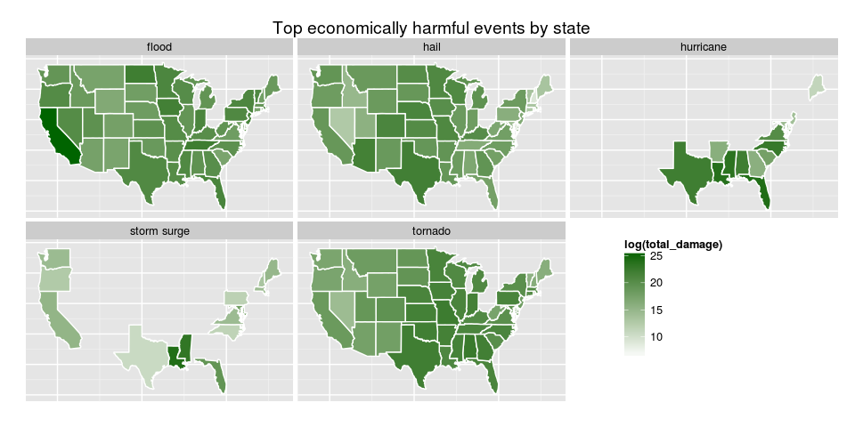

# An Analysis of weather-caused damage in the United States
Rodrigo Echeverría  
20/09/2014  

##Sinopsis
In this analysis we aim to discover how metheorolgical events affect both,
the public health and the economy of the U.S. To research this topic we will use 
data from the ational Oceanic and Atmospheric Administration's (NOAA) storm 
database, which includes records from 1950 up to 2011. 

To see how the events affect the public healt we take into account the number
of fatalities and injuries they provoked. In this regard, we discover that the top most harmful events are tornados, thunderstorm winds, excessive heat, floods and lightning (in that order). Also we see that the number of injuries is much bigger than the number of deaths and how these events affect each state.

To see how the events affect the economy, we take into account the economical
damage on the property and the crops. In this regard, we discover that the top
most harmful events are floods, hurricanes, tornados, storm surges and hails 
(in that order). As in the case of public health we study how each events affect
each state.


##1. Loading and Processing the Raw Data
This project involves exploring the U.S. National Oceanic and Atmospheric 
Administration's (NOAA) storm database. This database tracks characteristics of
major storms and weather events in the United States, including when and where 
they occur, as well as estimates of any fatalities, injuries, and property 
damage.

This database can be downloaded from [Storm Data](https://d396qusza40orc.cloudfront.net/repdata%2Fdata%2FStormData.csv.bz2). The directive that describes the data can
be found at [Directive](https://d396qusza40orc.cloudfront.net/repdata%2Fpeer2_doc%2Fpd01016005curr.pdf).

###1.1. Reading
Data is stored in a compressed (bz) coma separated file, in order to read it we 
can use the `read.csv()` function by passing to it a specialized connection to 
bz-compressed files `bzfile()`. From this point, the raw dataframe will be 
called `df`.

```r
df <- read.csv(bzfile("repdata_data_StormData.csv.bz2"))
```

The data consists on 902.297 observations of 37 variables, and we are 
particulary interested in a few of them:

* EVTYPE: type of event, storm, tornado, flood, etc.
* FATALITIES: estimate on the number of deaths caused by the event.
* INJURIES: estimate on the number of injured people caused by the event.
* PROPDMG: estimate on the economical cost to the properties. It is complemented 
           by the PROPDMGEXP variable, which is a multiplier.
* CROPDMG: estimate on the economical cost to the crops. It is complemented 
           by the CROPDMGEXP variable, which is a multiplier.

```r
dim(df)
```

```
## [1] 902297     37
```

```r
head(df[, c("EVTYPE", "FATALITIES", "INJURIES", "PROPDMG", "PROPDMGEXP",
            "CROPDMG","CROPDMGEXP")])
```

```
##    EVTYPE FATALITIES INJURIES PROPDMG PROPDMGEXP CROPDMG CROPDMGEXP
## 1 TORNADO          0       15    25.0          K       0           
## 2 TORNADO          0        0     2.5          K       0           
## 3 TORNADO          0        2    25.0          K       0           
## 4 TORNADO          0        2     2.5          K       0           
## 5 TORNADO          0        2     2.5          K       0           
## 6 TORNADO          0        6     2.5          K       0
```
###1.2. Subsetting
For this research purposes, we are interested only on those events where public
health or economical damage were done, so we can subset the data to those
observations where either fatalities, injuries, property damage or crop damage
are greater than 0. **From this point the clean dataset will be `df_c`**.

```r
select <- df$PROPDMG > 0 | df$CROPDMG > 0 | df$FATALITIES > 0 | df$INJURIES > 0
df_c <- df[select,]
```

###1.3. Cleaning event types
`EVTYPE` is a messy variable with 985 different events (which is huge if we take
into account that only 48 are recorded according t the official directive).

```r
length(levels(df$EVTYPE))
```

```
## [1] 985
```

Cleaning up the event types will thus, be the key step of the cleaning process.
While mapping the 985 levels to the correct 48 events would be optimal, it is a
rather time-consuming step, so only some cleanup steps will be followed:

1. ***Lower casing*** to group things like Tornado and tornado.
2. ***Eliminate punctuation*** like "/", "-", ".", "\\", "(", ")".
3. ***Eliminate measurements from events*** like g50 from wind g50 or 59 mph from
                                            wind 59 mph
4. ***Trim spaces*** at the beginning, end and the extra ones in the middle.
5. ***Correct typos and singularize*** like changing strom and storms for storm.
6. ***Rename hurricanes***, typhoons are described as hurricanes in the directive
and named hurricanes should be counted as hurricanes.


```r
## 1. Lower casing
clean_event_types <- tolower(df_c$EVTYPE) 
```


```r
## 2. Eliminate punctuation
clean_event_types <- gsub(pattern = "/", replacement = " ", x = clean_event_types)
clean_event_types <- gsub(pattern = "-", replacement = " ", x = clean_event_types)
clean_event_types <- gsub(pattern = "\\.", replacement = " ", x = clean_event_types)
clean_event_types <- gsub(pattern = "\\\\", replacement = " ", x = clean_event_types)
clean_event_types <- gsub(pattern = "\\(|\\)", replacement = "", x = clean_event_types)
```


```r
## 3. Eliminate measurements from events
clean_event_types <- gsub("[:space:]*[a-z]?\\d+[:space:]?.*$", "", clean_event_types)
```


```r
## 4. Trim spaces
clean_event_types <- gsub("^ *|(?<= ) | *$", "", clean_event_types, perl=T)
```


```r
## 5. Correct typos and singularize
clean_event_types <- gsub("flooding|floods", "flood", clean_event_types, perl=T)
clean_event_types <- gsub("strom|storms|stroms", "storm", clean_event_types, perl=T) 
clean_event_types <- gsub("winds|wnd|wins", "wind", clean_event_types, perl=T)
clean_event_types <- gsub("thunderestorm|thundertorm|thundertsorm|thunerstorm|tstm", 
                          "thunderstorm", clean_event_types, perl=T)
clean_event_types <- gsub("torndao|tornadoes", "tornado", clean_event_types, perl=T)
clean_event_types <- gsub("fires", "fire", clean_event_types, perl=T)
```


```r
## 6. Rename hurricanes
clean_event_types <- gsub("typhoon", "hurricane", clean_event_types, perl=T)
clean_event_types <- gsub("hurricane[:space:]?\\D*$", "hurricane", clean_event_types)
```

Once cleaned up, we can restore the unique clean event types (`as.factor()` will
take care of that).

```r
df_c$EVTYPE <- as.factor(clean_event_types)
```
For the subset dataset only 333 different event types remain.

```r
length(levels(df_c$EVTYPE))
```

```
## [1] 333
```

###1.4. Processing economical damage related columns
To calculate the total economical damage we will need to map the `PROPDMGEXP` 
and `CROPDMGEXP` to the numbers they represent. According to the directive these
multipiers can be a number, which indicates the exponent in base 10 or "k", "m"
or "b" for thousands, millions or billions respectivelly. These variables are
also a bit messy, and contain other characters, but they do not account for a
lot of observations.

```r
levels(df_c$PROPDMGEXP)
```

```
##  [1] ""  "-" "?" "+" "0" "1" "2" "3" "4" "5" "6" "7" "8" "B" "h" "H" "K"
## [18] "m" "M"
```

```r
levels(df_c$CROPDMGEXP)
```

```
## [1] ""  "?" "0" "2" "B" "k" "K" "m" "M"
```


```r
## Number of observations with unexected values in PROPDMGEXP and CROPDMGEXP
nrow(df_c[df_c$PROPDMGEXP %in% c("?","-","+","h") | 
       df_c$CROPDMGEXP %in% c("?","-","+","h"), ])
```

```
## [1] 13
```

In order to map the values we will use a map function (`map_f`) which 
contemplates three cases for the input:

1. String representing a number: it returns 10^number
2. Empty string: returns 1 (no multiplier)
3. Character: uses a map to return the proper number (1 for the characters not 
contemplated in the directive).


```r
map_f <- function(exp) {
  
  ## Digit: return 10^<number>
  if(exp %in% as.character(0:9)) 
    return (10^as.numeric(exp)) 
  
  ## Empty string
  if(nchar(as.character(exp)) == 0)
    return (1)
  
  ## Map is created by appending names to a vector 
  ## (now it can be accessed by  name)
  m <- c(1,1,1,1, 1000, 1000000, 1000000000)
  names(m) <- c("?","-","+","h","k","m","b")
  
  ## First un-capitalize the letter (K -> k) and then map (k -> 1000)
  return (as.numeric(m[tolower(exp)]))
}
```

With the map function we can create a couple of numerical columns for 
`PROPDMGEXP` and `CROPDMGEXP` by using `sapply()` on them.

```r
df_c$PROPDMGEXP.num <- sapply(X = as.character(df_c$PROPDMGEXP), FUN = map_f)
df_c$CROPDMGEXP.num <- sapply(X = as.character(df_c$CROPDMGEXP), FUN = map_f)
```

## 2. Results 
### 2.1. Which types of events are most harmful with respect to population health?

In order to address this question, first we have to determine what we consider
harm to the population health. For us, it will be the total number of deaths and
injuries produced by an event.

```r
df_c$INJURIES_AND_FATALITIES <- df_c$INJURIES + df_c$FATALITIES
```

In order to determine the most harmful events historically we will aggregate the
number of deaths (`FATALITIES`), injuries and the combination of both 
(`INJURIES_AND_FATALITIES`) by event type and state.

Then we will aggregate all the states together. This is done in two steps because
afterwards we will use the per-state information.

```r
a <- aggregate(cbind(INJURIES_AND_FATALITIES, INJURIES, FATALITIES) ~ EVTYPE + STATE, 
               df_c, sum)
a2 <- aggregate(cbind(INJURIES_AND_FATALITIES, INJURIES, FATALITIES) ~ EVTYPE, 
                a, sum)
```

We can obtain the top 10 most harmful types of events by ordering the sums by
number of injuries and fatalities from largest to smallest and taking the first 
ten using `head()`.

```r
top_ten <- head(a2[order(a2$INJURIES_AND_FATALITIES, decreasing = T),], 10)
print(top_ten)
```

```
##                EVTYPE INJURIES_AND_FATALITIES INJURIES FATALITIES
## 292           tornado                   96997    91364       5633
## 278 thunderstorm wind                   10074     9369        705
## 48     excessive heat                    8428     6525       1903
## 68              flood                    7267     6791        476
## 188         lightning                    6047     5230        817
## 106              heat                    3037     2100        937
## 59        flash flood                    2784     1785        999
## 174         ice storm                    2064     1975         89
## 150         high wind                    1723     1440        283
## 329      winter storm                    1554     1338        216
```

#### 2.1.1. Which is the proportion of fatalities and injuries for the top events?
As we are counting both fatalities and injuries together, it would be 
interesting to see the proportion of both for the top 10 most harmful events
Following plot uses a stacked barplot to show that.

In order to separate the bars in two colors (for injuries and fatalities), we 
need a long dataset -- in which injuries and fatalities for the same event are
in different rows and are distinguished by a factor, we use `melt()` from
`reshape` library to achieve that.

```r
library(reshape2)

top_ten_clean <- top_ten
top_ten_clean$INJURIES_AND_FATALITIES <- NULL

plot_data2 <- melt(top_ten_clean, id.vars = c("EVTYPE"))
print(plot_data2)
```

```
##               EVTYPE   variable value
## 1            tornado   INJURIES 91364
## 2  thunderstorm wind   INJURIES  9369
## 3     excessive heat   INJURIES  6525
## 4              flood   INJURIES  6791
## 5          lightning   INJURIES  5230
## 6               heat   INJURIES  2100
## 7        flash flood   INJURIES  1785
## 8          ice storm   INJURIES  1975
## 9          high wind   INJURIES  1440
## 10      winter storm   INJURIES  1338
## 11           tornado FATALITIES  5633
## 12 thunderstorm wind FATALITIES   705
## 13    excessive heat FATALITIES  1903
## 14             flood FATALITIES   476
## 15         lightning FATALITIES   817
## 16              heat FATALITIES   937
## 17       flash flood FATALITIES   999
## 18         ice storm FATALITIES    89
## 19         high wind FATALITIES   283
## 20      winter storm FATALITIES   216
```

With the melt data we use ggplot's package `geom_bar()` function to make a plot 
(value is the count of injuries/fatalities and variable a factor to distinguish them)

```r
library(ggplot2)

p <- ggplot(plot_data2, aes(x=reorder(EVTYPE, value),y = value, fill = variable)) 
p <- p + geom_bar(stat='identity')
p <- p + xlab("Event") + ylab("Injuries and fatalities") 
p <- p + ggtitle("Proportion of injuries and fatalities in top 10 most harmful events for public health")

print(p)
```

 
In the plot we can observe that `FATALITIES` account for a small part of the 
total.

#### 2.1.2. How do the top events affect each state?
Also, considering that this analysis is hypotetically written for a 
*"government or municipal manager who might be responsible for preparing*
*for severe weather events and will need to prioritize resources"* it would be
interesting to see how the different phenomena affects different states as 
methereological events will not hit them equally.

In order to do so, following plot will show a heat map of the top 5 most harmful 
events separated by states. To do so we will use the `maps` library. To create 
the map we have to merge the data from the top 5 (number of injuries/fatalities
per state and event) with the data in the map (latitudes and longitudes for 
each state).

We need a join table (in "states.csv") which maps state codes and names (maps 
uses the names, but the dataset uses the code). This simple csv can be downloaded
from my github account [states.csv](https://raw.githubusercontent.com/rodrigoecheverria/stormdb-analysis/master/states.csv).

```r
library(ggplot2)
library(maps)

all_states <- map_data("state")
states_codes <- read.csv("states.csv")
m <- merge(x = all_states, y = states_codes, by.x = "region", by.y="state")
head(m)
```

```
##    region   long   lat group order subregion code
## 1 alabama -88.46 31.70     1    70      <NA>   AL
## 2 alabama -88.48 31.89     1    71      <NA>   AL
## 3 alabama -88.43 32.22     1    72      <NA>   AL
## 4 alabama -88.43 32.31     1    73      <NA>   AL
## 5 alabama -88.45 31.43     1    69      <NA>   AL
## 6 alabama -84.99 32.50     1   123      <NA>   AL
```

Once we have the map data with the code, we can subset the top 5 and merge with
it the coordinates.

```r
top_five <- head(top_ten, 5)
data <- a[a$EVTYPE %in% top_five$EVTYPE,]
plot_data <- merge(x = m, y = data, by.x="code", by.y="STATE")
plot_data <- plot_data[order(plot_data$order),] ##points get disordered in the merge
head(plot_data)
```

```
##     code  region   long   lat group order subregion            EVTYPE
## 631   AL alabama -87.46 30.39     1     1      <NA>           tornado
## 632   AL alabama -87.46 30.39     1     1      <NA>    excessive heat
## 633   AL alabama -87.46 30.39     1     1      <NA>         lightning
## 634   AL alabama -87.46 30.39     1     1      <NA> thunderstorm wind
## 635   AL alabama -87.46 30.39     1     1      <NA>             flood
## 636   AL alabama -87.48 30.37     1     2      <NA>           tornado
##     INJURIES_AND_FATALITIES INJURIES FATALITIES
## 631                    8546     7929        617
## 632                      36       23         13
## 633                     182      154         28
## 634                     471      431         40
## 635                       2        0          2
## 636                    8546     7929        617
```

We will use the lattitude and longitude to draw the map, the number of
injuries/fatalities to fill it (darker meaning more) and the event types for the
facets (so each will be epresented in a different panel).

Injuries/fatalities are represented in a logarithmic scale because Tornado data
is an order of magnitude bigger and it would hide the results for the others.

```r
p <- ggplot()
p <- p + geom_polygon(data=plot_data, aes(x=long, y=lat, group = group, 
                                          fill = log(INJURIES_AND_FATALITIES)),
                      colour="white") 
p <- p + scale_fill_continuous(low = "white", high = "darkred",na.value = "gray", 
                               guide="colorbar")
p <- p + facet_wrap(facet=~EVTYPE, nrow = 2, ncol = 3) 
p <- p + theme(legend.position = c(0.8,0.3))
p <- p + theme(axis.title.x = element_blank(), axis.title.y = element_blank(), 
               axis.ticks = element_blank(), axis.text = element_blank()) 
p <- p + ggtitle("Top public health harmful events by state")

print(p)
```

 
From this plot we can add some information to what we already knew, while the 
tornados affect in an order of magnitude more than the other events, they do it 
more the states in the east, this can bee seen also for the thunderstorm winds
but in a closer proportion. Lightning as expected affects uniformly. Floods 
affect the states of the west coast and Texas specially. And, finally, excessive
heat affects the bottom part of the west coast, the top part of the east coas and 
a band in the middle.

### 2.2. Which types of events have the greatest economic consequences?

Economical damage is defined in the directive as the damage on properties, crops 
and other. Optimally, other damage can be extracted from the remarks column by 
doing natural language processing, but that could be a study in itself.

So, the approach we will take is to define the total economical damage 
(`total_damage`) as the sum of the `PROPDMG` and `CROPDMG` with the proper
multipliers. As the multiplier columns are already calculated, we can create
the `total_damage` column straightfordwardly.

```r
df_c$total_damage <- df_c$PROPDMG * df_c$PROPDMGEXP.num + df_c$CROPDMG * df_c$CROPDMGEXP.num

head(df_c[, c("EVTYPE", "PROPDMG", "PROPDMGEXP.num", "CROPDMG", 
              "CROPDMGEXP.num", "total_damage")], 10)
```

```
##     EVTYPE PROPDMG PROPDMGEXP.num CROPDMG CROPDMGEXP.num total_damage
## 1  tornado    25.0           1000       0              1        25000
## 2  tornado     2.5           1000       0              1         2500
## 3  tornado    25.0           1000       0              1        25000
## 4  tornado     2.5           1000       0              1         2500
## 5  tornado     2.5           1000       0              1         2500
## 6  tornado     2.5           1000       0              1         2500
## 7  tornado     2.5           1000       0              1         2500
## 8  tornado     2.5           1000       0              1         2500
## 9  tornado    25.0           1000       0              1        25000
## 10 tornado    25.0           1000       0              1        25000
```


As in the public healt harm case, we will aggregate the damage by type of event
and state, and then only by type of event.

```r
a <- aggregate(total_damage ~ EVTYPE + STATE,df_c, sum)
a2 <- aggregate(total_damage ~ EVTYPE, a, sum)
```

We can obtain the top 10 most costly types of events by ordering the sums by the 
`total_cost` from largest to smallest and taking the first ten using `head()`.

```r
top_ten <- head(a2[order(a2$total_damage, decreasing = T),], 10)
print(top_ten)
```

```
##                EVTYPE total_damage
## 68              flood    1.504e+11
## 161         hurricane    9.087e+10
## 292           tornado    5.737e+10
## 267       storm surge    4.332e+10
## 100              hail    1.876e+10
## 59        flash flood    1.858e+10
## 37            drought    1.502e+10
## 278 thunderstorm wind    1.108e+10
## 234       river flood    1.029e+10
## 174         ice storm    8.967e+09
```

#### 2.2.1. How do the top events affect each state?
Also as before it is interesting to see which states are more affected by which
event type, so we will create a heat map for the top five events. 

In order to do so, we can merge the coordinates data (calculated previously) 
with the economical damage data.

```r
top_five <- head(top_ten, 5)
data <- a[a$EVTYPE %in% top_five$EVTYPE,]
plot_data <- merge(x = m, y = data, by.x="code", by.y="STATE")
plot_data <- plot_data[order(plot_data$order),] ##it gets disordered in the merge
head(plot_data)
```

```
##     code  region   long   lat group order subregion    EVTYPE total_damage
## 505   AL alabama -87.46 30.39     1     1      <NA>     flood    3.081e+08
## 506   AL alabama -87.46 30.39     1     1      <NA>   tornado    6.378e+09
## 507   AL alabama -87.46 30.39     1     1      <NA> hurricane    4.107e+09
## 508   AL alabama -87.46 30.39     1     1      <NA>      hail    2.307e+07
## 509   AL alabama -87.48 30.37     1     2      <NA>     flood    3.081e+08
## 510   AL alabama -87.48 30.37     1     2      <NA>   tornado    6.378e+09
```

Following plot depicts in different panels the top causes and, for each, shows 
the most affected states (darker meaning more affected). Also as in the previous 
one `total_damage` is presented in a logarthmic scale bacause flood data is an
order of magnitude bigger and would hide the results in the other panels.

```r
p<- ggplot()
p <- p + geom_polygon(data=plot_data, aes(x=long, y=lat, group = group, 
                                          fill = log(total_damage)),
                      colour="white") 
p <- p + scale_fill_continuous(low = "white", high = "darkgreen",na.value = "gray", guide="colorbar")
p <- p + facet_wrap(facet=~EVTYPE, nrow = 2, ncol = 3) + theme(legend.position=c(0.8,0.3))
p <- p + theme(axis.title.x = element_blank(), axis.title.y = element_blank(), 
               axis.ticks = element_blank(), axis.text = element_blank()) 
p <- p + ggtitle("Top economically harmful events by state")

print(p)
```

 

From this plot we can add some information to what we already knew, similarly to
what happens with public health harm, tornados affect more the states in the east.
Storm surges affect both coasts and states in the south (Texas, Louisiana and 
Mississipi). Hurricanes only affect the East Coast. While hails affect all the 
states, they effect more significative in the middle band (remember this map is 
in a logarithmic scale). Floods affect all the states in an order of magnitude 
more than the other phenomena, and their effect is more pronounced in the states 
of the East.
